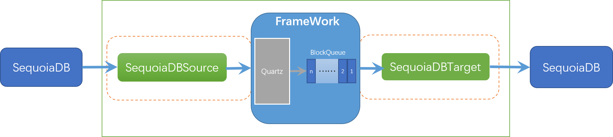
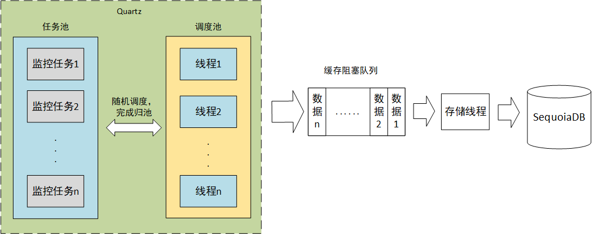

# monitor

## 概况

monitor 最初设计是作为 SequoiaDB 监控信息收集程序，目前支持收集以下监控指标：

- 节点状态，包括是否存活、节点数据读写或索引读写情况、与主节点lSN差值
- 上下文数，支持抓取超过特定数量的上下文数
- 会话数，包括Waiting、Running
- 是否存在表扫描

## 框架设计

monitor 作为定时监控信息收集程序，采用 Framework + Plugin 架构构建。将监控数据收集抽象为Source插件，将数据存储(监控告警)抽象为Target插件，纳入到整个框架中。

- Source：作为监控信息收集模块，负责采集系统的监控数据，并将数据以BSON格式Framework，数据采集频率由Framework控制。
- Target：作为监控信息存储模块，负责不断向Framework取数据，并保存至目标端。
- Framework：Framework用于连接Source和Target，作为两者的数据传输通道，并控制Source采集频率。

采集频率基于Quartz框架实现，框架整体图如下：



### 程序运行流程

程序根据配置文件配置的 Source 以及对应的监控项，生成调度任务存放至任务池中由 Quartz 负责调度，任务执行后收集的数据会存储至缓冲阻塞队列中，由存储池中的线程负责将其存储至 SequoiaDB，目前，存储池只包含一个线程，且不可配置。整体流程如下图：



由于任务的调度过程由 Quartz 随机进行调度，当 `quart.properties` 配置文件中 `org.quartz.threadPool.threadCount` 配置的线程数较小时，可能会存在任务到了触发时间，由于没有调度线程进行调度执行而沦落为过期任务，由 Quartz 的过期任务处理策略进行处理。
Quartz 的逾期任务是指经过了触发时间+`quartz.properties` 中 `org.quartz.jobStore.misfireThreshold` 所定义的时间(毫秒)之内，仍没有获得调度线程进行调度的任务。
Quartz 提供以下的逾期任务处理策略：

- 监控项的 `misifre` 值为 1 时，其含义是：当获取到调度线程时，立即执行，且重复执行从上次未执行的时间到当前时间所经过的调度周期。例如：上次未执行的时间是 1 分钟前，调度周期为 10 秒，则执行 6 次。
- 监控线的 `misfire` 值为 2 时，其含义是：放弃本次调度，等待下次调度周期再尝试进行调度。

为了缓解调度任务由于超过时间没有被调度而沦为过期任务的情况，可以采用以下几种处理方式：
- 增加 `quartz.properties` 配置文件中 `org.quartz.threadPool.threadCount` 配置的调度线程个数

- 增大 `quartz.properties` 文件中 `org.quartz.jobStore.misfireThreshold` 所定义的逾期任务容忍时

## 使用说明

### 程序打包

monitor 工程采用 maven 模块功能进行代码管理，可执行以下命令进行源码编译打包。

```bash
mvn clean package assembly:assenbly 
```

执行完毕后，会在工程的目录的 `target` 目录下生成 `monitor.tar.gz` 文件。该文件包含了程序的运行脚本以及jar包。解压的目录结构如下：

```basic
monitor
    bin
    conf
    lib
```

其中，`bin` 目录存放运行脚本，`conf` 目录存放程序配置文件，`lib` 存放程序依赖的 `jar` 包

> **Note:**
>
> 对于没有 `maven` 的情况，可以将每个子模块单独创建一个工程，将工程单独打包成一个 `jar` 包，并复制到  `lib` 目录下

### 启动程序

1. 将 `monitor.tar.gz` 解压到对应的目录
2. 修改 `conf` 目录下的 `sysconf.properties` 文件，若需要密码加密，则参考[密码加密](#密码加密)章节加密。

3. 切换至bin目录，执行

```bash
nohup sh ./sdbmonitor.sh >> /dev/null 2>&1 &
```

> **Note:**
>
> 默认程序运行日志文件在程序所在目录 `logs`下，生成 `monitor.log`文件，若需要修改日志配置，则修改 `logback.xml`文件。 

### 密码加密

目前程序支持密码加密，密码算法为`SM2`，执行以下命令加密密码。

```bash
sh sdbmonitor.sh -p sdbadmin
```

### sysconf.properties 配置参数说明

```pro
# 基于zookeeper 实现高可用
#monitor.zk.url=
#monitor.zk.watcher.path=/master
#monitor.zk.session.timeout=500

# 监控源类型，多个监控源以逗号(,)分隔
# 目前只支持sdb
monitor.source.type=sdb

# 监控源 sdb 版本类型，支持的值为：2.8.x,3.2.x
monitor.source.sdb.version=2.8.x
# 监控源 sdb 协调节点地址，多个地址以逗号分隔(,)
monitor.source.sdb.host=sdbserver1:11810
# 监控源 sdb 数据库连接用户
monitor.source.sdb.user=sdbadmin
# 监控源 sdb 连接超时，单位为毫秒(ms)
monitor.source.sdb.connect.timeout=100
# 监控源 sdb 连接自动重试次数，建议值为0，不重试
monitor.source.sdb.connect.retry=0
# 监控源 sdb socket通信超时，单位为毫秒
# 例如：设置值为200，表示200毫秒内还没从sdb中获取完数据，则抛 Socket Read Timeout Exception 异常
monitor.source.sdb.socket.timeout=200
# 监控源 sdb 加密的密码
monitor.source.sdb.password=0416FB9277DB3A159D6ADBD52EAD24934CB8FAD91301C587FF63B2E95E20E43B5B816F0A4694E68570CF583A0919677F6828E6A7A99BDF243265889C06C4EDAF575A1A88EA205FA159252455D13B2B940A2D7A97D90133F537523B9034F0DD802C32F1CA6D72B5BECC
# 监控源 sdb 密码私钥
monitor.source.sdb.password.private_key=0099040BCD777736712B8F46FC455E8744A80B65BA8139BC0FE1729D49D674BE08
# 监控源 sdb 密码密钥
monitor.source.sdb.password.public_key=047D8C7ED41E4BE44684E306CC9BE5DEB914BAF584B05CDF84E87D0AD47FE92842736273F4B663541F5CAB465BC0127D4F17BC199FEE99F90104366FC4CB4FF729
# 监控源 sdb 密码加密类型
monitor.source.sdb.password.encrypt_type=SM2

# sdb 节点信息
# on表示收集，off表示不收集
monitor.source.type.sdb.sdb_node=on
# 节点信息收集类型，多个类型以逗号(,)分隔
# node_status表示收集节点状态信息
# node_lsn表示收集节点主备节点LSN值差
# node_perf表示收集节点性能数据，默认收集TotalDataRead,TotalIndexRead,可通过args项进行自定义收集属性
monitor.source.sdb.sdb_node.items=node_status,node_lsn
# cron表示式，表示执行频率
monitor.source.sdb.sdb_node.cron=0/5 * * * * ?
# 监控信息输出位置,每一个项必须以;结尾
# cl:node，表示保存的集合名为 node
# cs:monitor，表示保存的集合空间为 monitor，不配置时采用 monitor.target.sdb.cs 配置的集合空间
# backup:n，表示存储历史数据并保留 n 个月的历史数据，-1则表示不保留历史数据，不配置时，采用 monitor.target.sdb.backup 配置的值。
# 历史数据单独存储与以 cl + monitor.target.sdb.suffix 配置的后缀组成的集合，如：节点信息的历史数据存储与 node_history 集合中
monitor.source.sdb.sdb_node.output=cl:node;
# 自定义变量
# node_perf:TotalDataRead，自定义收集的属性项，多个属性项以逗号(,)分隔，字段名必须与SDB_SNAPSHOT_DATABASE中的字段名保持一致，且不支持嵌套的字段
monitor.source.sdb.sdb_node.args=
# 逾期处理规则
monitor.source.sdb.sdb_node.misfire=1

# sdb 会话数
# on表示收集，off表示不收集
monitor.source.type.sdb.sdb_session=on
# 会话信息收集类型，目前无支持类型
monitor.source.sdb.sdb_session.items=
# cron表示式，表示执行频率
monitor.source.sdb.sdb_session.cron=0/5 * * * * ?
# 监控信息输出位置,每一个项必须以;结尾
# cl:session，表示保存的集合名为 session
# cs:monitor，表示保存的集合空间为 monitor，不配置时采用 monitor.target.sdb.cs 配置的集合空间
# backup:n，表示存储历史数据并保留 n 个月的历史数据，-1则表示不保留历史数据，不配置时，采用 monitor.target.sdb.backup 配置的值。
# 历史数据单独存储与以 cl + monitor.target.sdb.suffix 配置的后缀组成的集合，如：会话信息的历史数据存储与 session_history 集合中。
monitor.source.sdb.sdb_session.output=cl:session;
# 自定义参数,支持include:
# include:sdserver1:11810; 表示只收集sdbserver1:11810节点的会话信息，不配置收集所有
monitor.source.sdb.sdb_session.args=
# 逾期处理规则
monitor.source.sdb.sdb_session.misfire=1

# sdb 节点上下文数量
monitor.source.type.sdb.sdb_context=on
# 上下文信息收集类型，目前无支持类型
monitor.source.sdb.sdb_context.items=
# cron表示式，表示执行频率
monitor.source.sdb.sdb_context.cron=0/5 * * * * ?
# 监控信息输出位置,每一个项必须以;结尾
# cl:context，表示保存的集合名为 context
# cs:monitor，表示保存的集合空间为 monitor，不配置时采用 monitor.target.sdb.cs 配置的集合空间
# backup:n，表示存储历史数据并保留 n 个月的历史数据，-1则表示不保留历史数据，不配置时，采用 monitor.target.sdb.backup 配置的值。
# 历史数据单独存储与以 cl + monitor.target.sdb.suffix 配置的后缀组成的集合，如：会话信息的历史数据存储与 context_history 集合中。
monitor.source.sdb.sdb_context.output=cl:context;
# 自定义参数，支持alarmcount,include
# alarmcount:n; 表示抓取上下文数量超过n的上下文信息
# include:sdbserver1:11820; 表示值收集sdbserver1:11820节点的上下文信息
monitor.source.sdb.sdb_context.args=alarmcount:1;
# 逾期处理规则
monitor.source.sdb.sdb_context.misfire=1

# sdb 表扫描
# on表示收集，off表示不收集
monitor.source.type.sdb.sdb_tbscan=on
# 上下文信息收集类型，目前无支持类型
monitor.source.sdb.sdb_tbscan.items=
# cron表示式，表示执行频率
monitor.source.sdb.sdb_tbscan.cron=0/5 * * * * ?
# 监控信息输出位置,每一个项必须以;结尾
# cl:tb_scan; 表示保存的集合名为 tb_scan
# cs:monitor; 表示保存的集合空间为 monitor，不配置时采用 monitor.target.sdb.cs 配置的集合空间
# backup:n; 表示存储历史数据并保留 n 个月的历史数据，-1则表示不保留历史数据，不配置时，采用 monitor.target.sdb.backup 配置的值。
# 历史数据单独存储与以 cl + monitor.target.sdb.suffix 配置的后缀组成的集合，如：会话信息的历史数据存储与 tb_scan_history 集合中。
monitor.source.sdb.sdb_tbscan.output=cl:tb_scan;
# 自定义参数，支持include
# include:sdbserver1:11820; 表示只收集sdbserver1:11820节点的表扫描，多个节点以逗号(,)分隔
monitor.source.sdb.sdb_tbscan.args=
# 逾期处理规则
monitor.source.sdb.sdb_tbscan.misfire=1

# 监控信息存储目标端，多个目标端以逗号(,)分隔
# 目前支持sdb
monitor.target.type=sdb

# 目标端 sdb 协调节点地址，多个以逗号(,)分隔
monitor.target.sdb.host=sdbserver1:11810
# 目标端 sdb 连接用户
monitor.target.sdb.user=sdbadmin
# 目标端 sdb 连接超时，单位为毫秒(ms)
monitor.target.sdb.connect.timeout=200
# 目标端 sdb 连接自动重试次数
monitor.target.sdb.connect.retry=0
# 目标端 sdb socket通信超时，单位为毫秒(ms)
# 例如：设置值为200，表示200毫秒内还没把数据写完sdb，则抛 Socket Read Timeout Exception 异常
monitor.target.sdb.socket.timeout=60000
# 目标端 sdb 加密密码
monitor.target.sdb.password=0416FB9277DB3A159D6ADBD52EAD24934CB8FAD91301C587FF63B2E95E20E43B5B816F0A4694E68570CF583A0919677F6828E6A7A99BDF243265889C06C4EDAF575A1A88EA205FA159252455D13B2B940A2D7A97D90133F537523B9034F0DD802C32F1CA6D72B5BECC
# 目标端 sdb 加密私钥
monitor.target.sdb.password.private_key=0099040BCD777736712B8F46FC455E8744A80B65BA8139BC0FE1729D49D674BE08
# 目标端 sdb 加密公钥
monitor.target.sdb.password.public_key=047D8C7ED41E4BE44684E306CC9BE5DEB914BAF584B05CDF84E87D0AD47FE92842736273F4B663541F5CAB465BC0127D4F17BC199FEE99F90104366FC4CB4FF729
# 目标端 sdb 加密算法类型，目前只支持SM2
monitor.target.sdb.password.encrypt_type=SM2
# 监控数据存储数据域，若该数据域不存在，则创建一个涵盖所有数据组的数据域
monitor.target.sdb.domain=monitorDomain
# 存储数据的集合空间，若该集合空间不存在，则自动创建
monitor.target.sdb.cs=monitor
# 保留 n 个月的历史数据，-1则表示不保留历史数据
monitor.target.sdb.backup=1
# 历史数据集合名后缀
monitor.target.sdb.suffix=_history
```

### logback.xml配置文件说明

```xml
<?xml version="1.0" encoding="UTF-8"?>
<!--
scan：当此属性设置为true时，配置文件如果发生改变，将会被重新加载，默认值为true。
scanPeriod：设置监测配置文件是否有修改的时间间隔，如果没有给出时间单位，默认单位是毫秒,当scan为true时，此属性生效。默认的时间间隔为1分钟。
debug：当此属性设置为true时，将打印出logback内部日志信息，实时查看logback运行状态。默认值为false。
-->
<configuration scan="false" scanPeriod="60 seconds" debug="false">
    <!-- 定义日志的根目录, ${logs.dir}指向程序所在目录/logs目录 -->
    <property name="LOG_HOME" value="${logs.dir}" />
    <!-- 定义日志文件名称 -->
    <property name="appName" value="monitor"/>
    <!-- ch.qos.logback.core.ConsoleAppender 表示控制台输出 -->
    <appender name="stdout" class="ch.qos.logback.core.ConsoleAppender">
        <Encoding>UTF-8</Encoding>
        <!--
        日志输出格式：%d表示日期时间，%thread表示线程名，%-5level：级别从左显示5个字符宽度
        %logger{50} 表示logger名字最长50个字符，否则按照句点分割。 %msg：日志消息，%n是换行符
        -->
        <layout class="ch.qos.logback.classic.PatternLayout">
            <pattern>%d{yyyy-MM-dd HH:mm:ss.SSS} [%thread] [%-5level] [%logger:%line] - %msg%n</pattern>
        </layout>
    </appender>

    <appender name="appLogAppender"
              class="ch.qos.logback.core.rolling.RollingFileAppender">
        <file>${LOG_HOME}/${appName}.log</file>

        <rollingPolicy class="ch.qos.logback.core.rolling.FixedWindowRollingPolicy">
            <fileNamePattern>${LOG_HOME}/${appName}.log.%i</fileNamePattern>
            <minIndex>1</minIndex>
            <!--序号最大值，表示最多保留n+1个日志文件-->
            <maxIndex>5</maxIndex>
        </rollingPolicy>

        <triggeringPolicy
                class="ch.qos.logback.core.rolling.SizeBasedTriggeringPolicy">
            <!--每个日志文件大小为100MB-->
            <maxFileSize>100MB</maxFileSize>
        </triggeringPolicy>
        <encoder>
            <pattern>%d{yyyy-MM-dd HH:mm:ss.SSS} [%thread] - [%-5level] [%logger:%line] - %msg%n</pattern>
        </encoder>
    </appender>

    <!--
    root与logger是父子关系，没有特别定义则默认为root，任何一个类只会和一个logger对应，
    要么是定义的logger，要么是root，判断的关键在于找到这个logger，然后判断这个logger的appender和level。
    -->
    <root level="info">
        <!--建议生产环境不要输出到终端，即去掉stdout-->
        <appender-ref ref="stdout" />
        <appender-ref ref="appLogAppender" />
    </root>
</configuration>
```

### quartz.properties配置文件

该配置文件用于配置Quartz框架。

```properties
org.quartz.scheduler.instanceName: monitor
org.quartz.scheduler.rmi.export: false
org.quartz.scheduler.rmi.proxy: false
org.quartz.scheduler.wrapJobExecutionInUserTransaction: false

org.quartz.threadPool.class: org.quartz.simpl.SimpleThreadPool
# Quartz调度内存池大小
org.quartz.threadPool.threadCount: 1
org.quartz.threadPool.threadPriority: 5
org.quartz.threadPool.threadsInheritContextClassLoaderOfInitializingThread: true

# 任务预期时间，单位是毫秒(ms)
org.quartz.jobStore.misfireThreshold: 1000

org.quartz.jobStore.class: org.quartz.simpl.RAMJobStore
# 优雅退出插件
org.quartz.plugin.shutdownhook.class = org.quartz.plugins.management.ShutdownHookPlugin
# true表示启用优雅退出
# false表示不启用
org.quartz.plugin.shutdownhook.cleanShutdown = true

```

### Cron表达式说明

monitor程序采用 cron 表达式配置定时周期，cron语法如下：

```bash
*  *  * *  *  ?
秒 分 时 日 月 周几
```

若对cron表达式不熟悉，可使用在线Cron计算器进行计算特定的时间
http://cron.qqe2.com/

Cron表达式范例：

每隔5秒执行一次：0/5 * * * * ?

每隔1分钟执行一次：0 0/1 * * * ?

每天23点执行一次：0 0 23 * * ?

每天凌晨1点执行一次：0 0 1 * * ?

每月1号凌晨1点执行一次：0 0 1 1 * ?

每月最后一天23点执行一次：0 0 23 L * ?

每周星期天凌晨1点实行一次：0 0 1 ? * L

在26分、29分、33分执行一次：0 26,29,33 * * * ?

每天的0点、13点、18点、21点都执行一次：0 0 0,13,18,21 * * ?

### 数据表字段说明

#### 节点信息数据表(node)

| 字段名        | 字段类型 | 含义              | 备注                                                         |
| ------------- | -------- | ----------------- | ------------------------------------------------------------ |
| monitortime   | string   | 监控时间          | 格式为："yyyyMMddHHmmss"                                     |
| nodename      | string   | 节点名            | 格式为：hostname:svcName                                     |
| groupname     | string   | 数据组名          |                                                              |
| isprimary     | boolean  | 是否为主节点      | true表示主节点，false表示非主节点                            |
| servicestatus | boolean  | 是否为可服务状态  | true表示可服务，false表示不可服务                            |
| status        | String   | 节点状态          | 存在的值：<br>Normal:节点正常<br>Abnormal:节点异常<br>FullSync：节点处于全量同步<br>Rebuilding：节点处于重建状态，此时该节点所属复制组所有节点异常重启时处于这个状态<br>OfflineBackup：节点处于离线备份状态 |
| errorinfo     | String   | 节点错误信息      | 1. 当节点由于连接超时异常时，错误信息为：connect timed out<br>2. 当节点由于socket通信超时时，错误信息为：Read timed out |
| currentlsn    | long     | 当前LSN的偏移     | 1. 节点异常时，值为-1<br>2. 协调节点的值为0                  |
| completelsn   | long     | 已完成 LSN 的偏移 | 1. 节点异常时，值为-1<br>2. 协调节点的值为0                  |
| difflsn       | long     | 与主节点LSN差值   | 1. 当节点异常时，值为-1<br>2. 节点所属复制组无主节点时，值为-1 |
| totaldataread | String   | 节点数据读        | 若monitor.source.sdb.sdb_node.items没有配置node_perf,则不会有该字段<br>monitor.source.sdb.sdb_node.args 配置的自定义属性项，对应全小写的字段名，即TotalDataRead对应的字段名为totaldataread |


#### 会话信息数据表(session)

| 字段名      | 字段类型 | 含义                      | 备注                     |
| ----------- | -------- | ------------------------- | ------------------------ |
| monitortime | String   | 监控时间                  | 格式为："yyyyMMddHHmmss" |
| nodename    | String   | 节点名称                  | 格式为：hostname:svcName |
| waiting     | long     | 会话处于Waiting状态的数量 |                          |
| running     | long     | 会话处于Running状态的数量 |                          |

#### 上下文信息数据表(context)

| 字段名      | 字段类型 | 含义       | 备注                     |
| ----------- | -------- | ---------- | ------------------------ |
| monitortime | String   | 监控时间   | 格式为："yyyyMMddHHmmss" |
| nodename    | String   | 节点名称   | 格式为：hostname:svcName |
| sessionid   | long     | 会话id     |                          |
| totalcount  | int      | 上下文数量 |                          |

#### 表扫描数据表(tb_scan)

| 字段名      | 字段类型 | 含义     | 备注                     |
| ----------- | -------- | -------- | ------------------------ |
| nodename    | String   | 节点名称 | 格式为：hostname:svcName |
| monitortime | String   | 监控时间 | 格式为："yyyyMMddHHmmss" |
| clname      | String   | 集合名   |                          |
| matcher     | String   | 查询条件 |                          |


